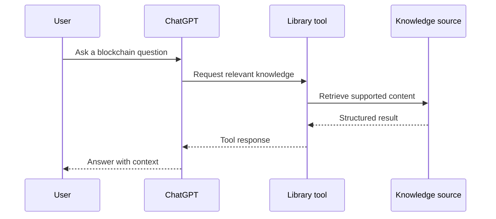

```mermaid
sequenceDiagram
  participant U as User
  participant C as ChatGPT
  participant T as Library tool
  participant K as Knowledge source
  U->>C: Ask a blockchain question
  C->>T: Request relevant knowledge
  T->>K: Retrieve supported content
  K-->>T: Structured result
  T-->>C: Tool response
  C-->>U: Answer with context
```

## Design goal

The app should help users reach useful educational material without presenting unsupported claims as authoritative facts.
