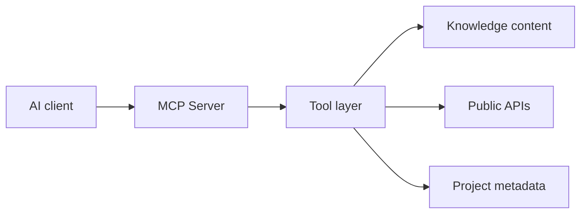

```mermaid
flowchart LR
  A[AI client] --> B[MCP Server]
  B --> C[Tool layer]
  C --> D[Knowledge content]
  C --> E[Public APIs]
  C --> F[Project metadata]
```

## Boundaries

The MCP layer should validate inputs, minimize data exposure, return structured outputs, and avoid embedding credentials in source code.
